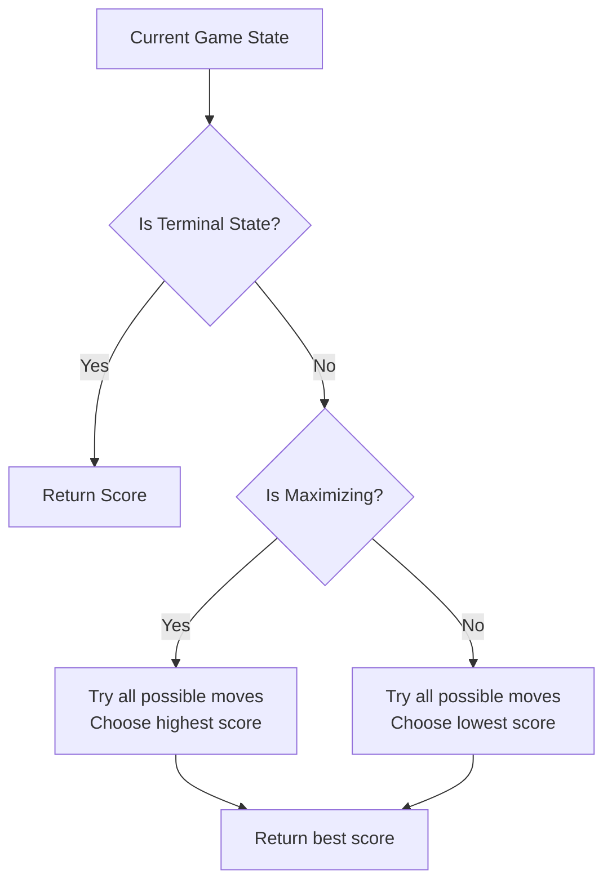
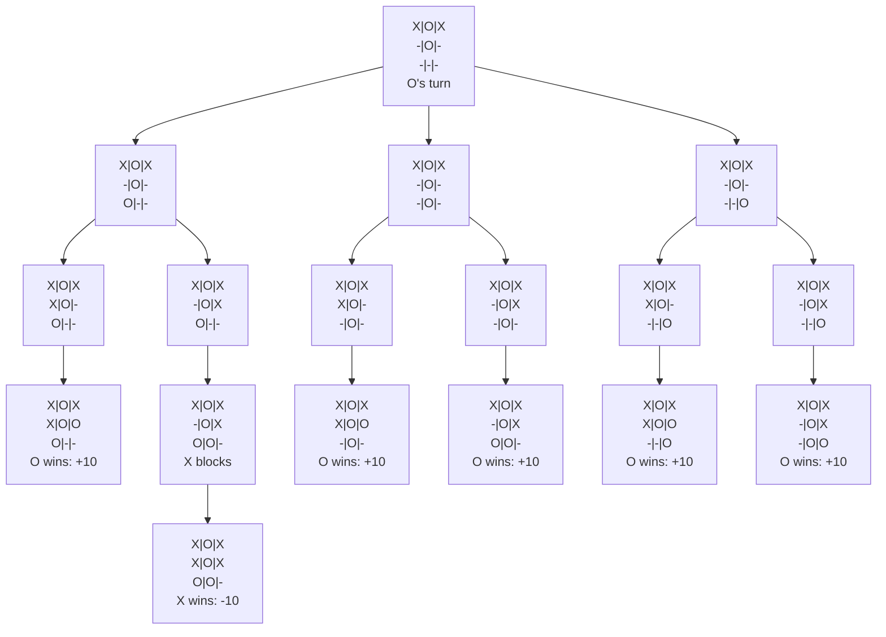

# Understanding the Unbeatable Tic Tac Toe Algorithm

This document explains how the minimax algorithm makes the Tic Tac Toe AI unbeatable in the "hard" difficulty setting.

## How Minimax Works

The minimax algorithm is a decision-making algorithm that recursively searches through all possible game states to find the optimal move. It assumes that both players play optimally.

### Key Concepts:

1. **Maximizer and Minimizer**: The AI (O) is the maximizer trying to get the highest score, while the player (X) is the minimizer trying to get the lowest score.
2. **Game States**: Every possible configuration of the board.
3. **Terminal States**: When the game ends (win, loss, or draw).
4. **Depth**: How many moves into the future we're looking.
5. **Score**: A value assigned to each terminal state.

### Scoring System:

- AI wins: +10 (minus depth)
- Player wins: -10 (plus depth)
- Draw: 0

The depth adjustment encourages the AI to win as quickly as possible or lose as slowly as possible.

## Algorithm Flow



## Example: Simple Game Analysis

Let's analyze a small part of a game. Consider this board:

```
X | O | X
--+---+--
  | O |  
--+---+--
  |   |  
```

### Minimax Decision Tree



In this example, most paths lead to an O win, so the AI would select one of these winning moves.

## Step-by-Step Walkthrough

Let's trace through the algorithm on a simpler example:

```
X | O |  
--+---+--
  | X |  
--+---+--
  |   |  
```

The AI (O) needs to decide where to place its next move:

1. For each empty cell, the AI:
   - Temporarily places 'O'
   - Calculates the value through minimax recursion
   - Undoes the move
   - Keeps track of the best score

2. When evaluating the top-right position:
   ```
   X | O | O
   --+---+--
     | X |  
   --+---+--
     |   |  
   ```
   This doesn't lead to an immediate win, so minimax will explore the player's possible responses.

3. For the center-left position:
   ```
   X | O |  
   --+---+--
   O | X |  
   --+---+--
     |   |  
   ```
   The player could place an 'X' in the bottom-left corner to create a winning threat.

4. For the bottom-right position:
   ```
   X | O |  
   --+---+--
     | X |  
   --+---+--
     |   | O
   ```
   This allows the player to create a winning threat.

5. The optimal move is in the bottom-left position:
   ```
   X | O |  
   --+---+--
     | X |  
   --+---+--
   O |   |  
   ```
   This blocks the player's potential diagonal win.

## Why the AI is Unbeatable

The minimax algorithm:

1. **Explores all possibilities**: It checks every possible future game state.
2. **Assumes optimal play**: It prepares for the best possible moves from the opponent.
3. **Prioritizes winning paths**: It always chooses the path with the highest chance of winning.
4. **Avoids losing paths**: It blocks any potential winning moves by the player.

When playing perfectly, Tic Tac Toe always results in a draw if both players play optimally. The AI will either win (if the player makes a mistake) or force a draw.

## Optimization: Alpha-Beta Pruning

For more complex games, the minimax algorithm can be optimized with alpha-beta pruning, which reduces the number of nodes evaluated by eliminating branches that cannot influence the final decision.

```mermaid
flowchart TD
    A[Current State] --> B{Is Terminal State?}
    B -->|Yes| C[Return Score]
    B -->|No| D{Is Maximizing?}
    D -->|Yes| E[Initialize best = -∞]
    D -->|No| F[Initialize best = +∞]
    E --> G[For each possible move]
    F --> H[For each possible move]
    G --> I[Calculate score recursively]
    H --> J[Calculate score recursively]
    I --> K[best = max(best, score)]
    J --> L[best = min(best, score)]
    K --> M[Prune if best > beta]
    L --> N[Prune if best < alpha]
    M --> G
    N --> H
    K --> O[Return best]
    L --> O
```

With this algorithm, the computer player can never lose at Tic Tac Toe when set to "hard" difficulty, making it truly unbeatable!